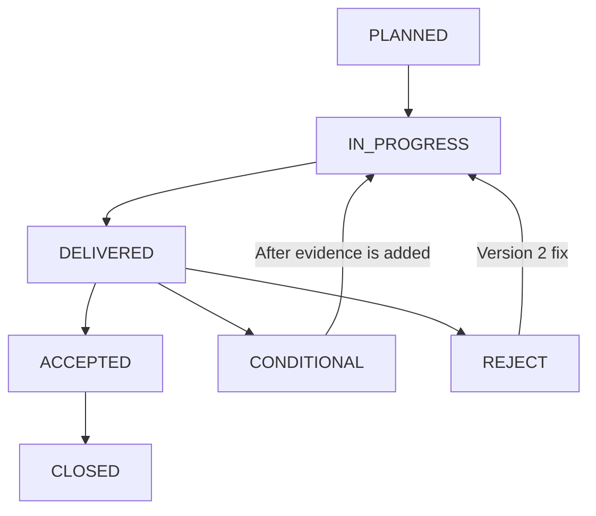

# Task State Machine (O-1 / PROP-029 v2 / 2026-05-21)

> **The simplified 5+2 state model** has five main states and two branches, adapted to the {{PROJECT_NAME}} workflow of one person with multiple PM responsibilities.

## 1. State definitions

| State | Meaning |
|---|---|
| PLANNED | PRD or handoff card created; awaiting an owner |
| IN_PROGRESS | The receiving PM is working: Development PM, Test and Release PM, or another PM; tools serve only as execution runtimes |
| DELIVERED | Completion card and passing unit tests/build/smoke; awaiting PM acceptance |
| ACCEPTED | PM verification passed; entering archival completion |
| CONDITIONAL | Main work passed, but evidence is missing, behavior is slow, or verification remains pending |
| REJECT | Smoke failed; return for rework |
| CLOSED | Complete and archived through RETRO |

Five main states plus two branches, CONDITIONAL and REJECT, make seven enum values.

## 2. Transitions



## 3. State triggers

| State | Trigger | Exit condition |
|---|---|---|
| **PLANNED** | PM creates a PRD or handoff card | Recipient reads the card and starts work |
| **IN_PROGRESS** | Recipient executes the card | Completion card written |
| **DELIVERED** | Completion card and passing tests/build | PM verification |
| **ACCEPTED** | PM acceptance passed | Complete archiving |
| **CONDITIONAL** | Main work passed; minor issues need verification, such as slow F-NIGHT OFF behavior in issue CF | Add evidence → DELIVERED |
| **REJECT** | Smoke failed or acceptance criteria unmet, such as W-3 v1 / F-NIGHT-1 v1 | Version 2 rework → IN_PROGRESS |
| **CLOSED** | RETRO archived and issue permanently closed / Task completed | Terminal state |

## 4. Application points

### 1. Handoff card section ⑤: cautions, required in every card

```markdown
## ⑤ Cautions
- **Status**: PLANNED → IN_PROGRESS (recipient changes it after reading)
- Other cautions...
```

### 2. Add a `State` column to the current active table in TASKS.md

```markdown
| # | Task | State | Trigger |
|---|---|---|---|
| #72 | PROP-029 v2 | IN_PROGRESS | This card |
```

### 3. Align completion-return values in the PM transition log in 状态.md

```markdown
| Time | From | To | Task | DC completed? | Status |
|---|---|---|---|---|---|
| 15:50 | PM | Operating System PM | PROP-029 v2 upgrade | ✅ | IN_PROGRESS |
```

## 5. Why not yuanxing's ten states?

- The ten-state yuanxing model, including WAIT_DECISION / NEED_MORE_EVIDENCE, serves collaboration among multiple people and concurrent work streams.
- {{PROJECT_NAME}} uses one person with multiple PM responsibilities, with centralized Project PM acceptance. Five main states and two branches cover this workflow.
- Evolution philosophy, principle 1: do not blindly match an external framework.

## 6. Relationship to issue states

| Task state | Corresponding issue state |
|---|---|
| PLANNED | Issue registered in the candidate backlog |
| IN_PROGRESS | Issue in active work |
| DELIVERED | Issue code implementation complete |
| ACCEPTED | Issue physical-device verification complete |
| CLOSED | Issue permanently closed or archived for monitoring |

## 7. Version

- v1, 2026-05-21 / PROP-029 v2 implementation.

For decision ownership—who changes state—see the [role-boundary path allowlist](角色边界.md) and [decision-checkpoint](../07_完整工作流/decision-checkpoint.md) Q1–Q7.
